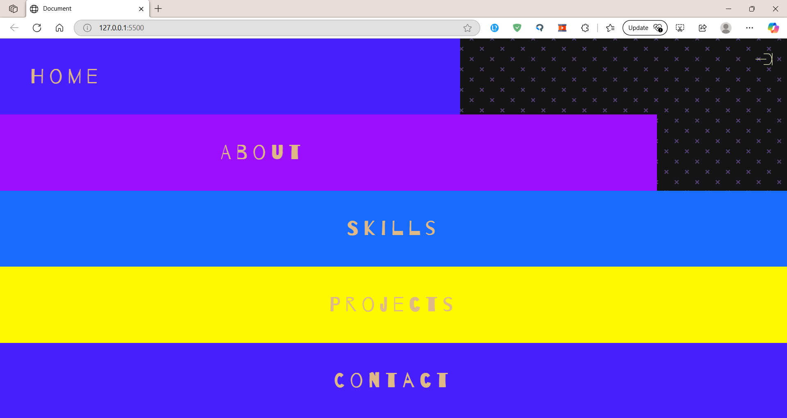

# 🎨 Animated Sidebar with HTML, CSS, and JavaScript 🎬

An elegant and smooth animated sidebar built using **HTML, CSS, and JavaScript**. This project enhances UI/UX with a modern and interactive navigation experience.

## 🚀 Features

- 📌 **Smooth Animation:** Sidebar opens and closes with sleek transitions.
- 🎨 **Customizable Design:** Easily modify styles to fit any project.
- ⚡ **Lightweight & Fast:** Minimal code for maximum performance.
- 🌍 **Responsive Layout:** Works on different screen sizes.

## 🎬 Demo Video

[🔗 Click to Watch the Demo](https://drive.google.com/file/d/1TldWNeG9yhGganvKMwVZuL9JGBTtxDpX/view?usp=sharing)

## 📸 Preview




## 🤝 Contributing

Contributions are welcome! 🎉 Fork the repository and submit a pull request with your improvements.

## 🛠️ Installation

Clone the repository and open `index.html` in your browser:

```bash
git clone https://github.com/your-username/your-repo-name.git
cd your-repo-name

